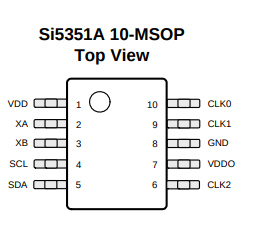
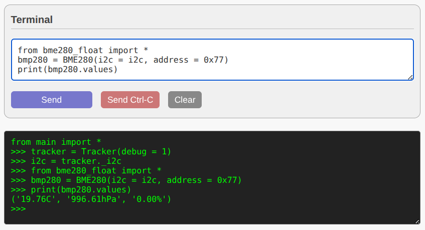
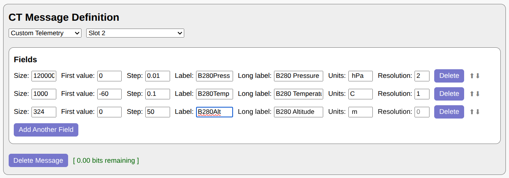
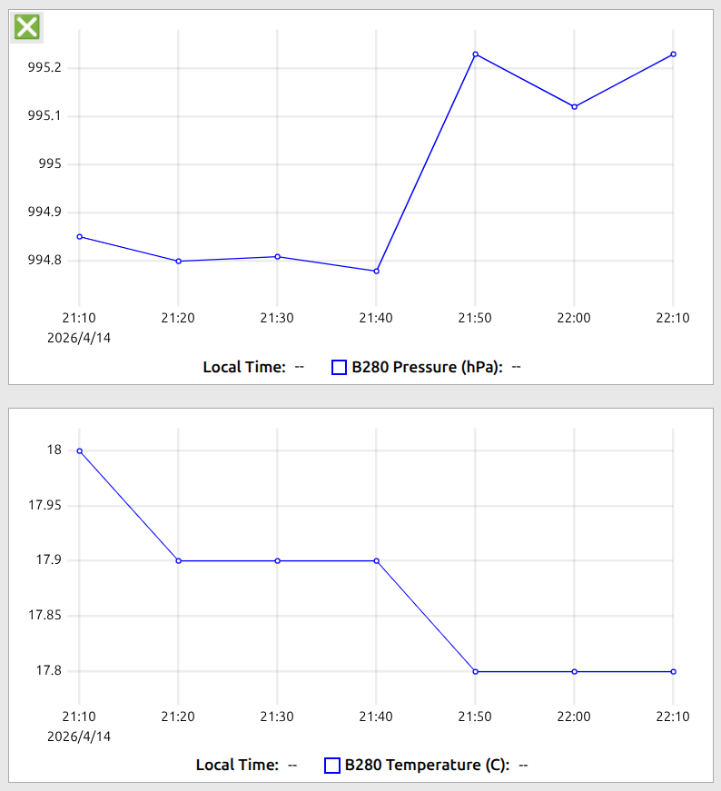
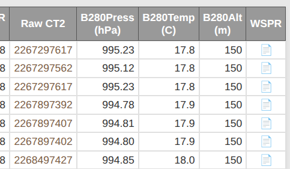

# Nomad

Nomad is a lightweight yet full-featured U4B-protocol picoballoon
tracker written in [MicroPython](https://micropython.org/). The entire
tracker is provided as a single Python file (`nomad.py`) with no
dependencies.

In addition to supporting several existing RP2040 / RP2350-based
trackers out of the box, Nomad can be adapted to new designs with
minimal changes. Custom boards only require a [MicroPython supported
microcontroller](https://micropython.org/download), a GPS module, and an
si5351a / ms5351m clock generator.

## Links
* **[Online Setup Tool](https://wsprtv.com/nomad/setup.html)**
* [GitHub Repository](https://github.com/wsprtv/nomad)

## Supported Hardware

Nomad currently has built-in support for the following tracker boards:
* [ag6ns](https://github.com/kaduhi/sf-hab_rp2040_picoballoon_tracker_pcb_gen1)
* `devel` (specify your own pin connections)
* [jawbone](https://github.com/EngineerGuy314/JAWBONE)
* [traquito](https://traquito.github.io)

## Installation

### 1. Flash MicroPython
First, install the MicroPython firmware onto your board:

1. Download the latest `.uf2` file for your specific microcontroller from 
the [MicroPython Downloads page](https://micropython.org/download/) 
(e.g., [Pico](https://micropython.org/download/rp2-pico/rp2-pico-latest.uf2)).
2. Put your board into BOOTSEL mode (hold the BOOT button while plugging 
it into USB).
3. Drag and drop the downloaded `.uf2` file onto the mounted USB mass 
storage drive. The board will automatically reboot.

### 2. Upload Firmware and Configuration
**Method A: Nomad Setup Tool (Recommended)**

The easiest way to install the firmware and configure your tracker is by 
using the browser-based setup tool (requires a Web Serial-compatible 
browser like Chrome, Edge, or Opera):

1. Open the [Nomad Setup Tool](https://wsprtv.com/nomad/setup.html).
2. Click **Connect to Device** and select your board from the popup.
3. Under *Firmware Installation*, click **Install Latest from GitHub** 
(this automatically downloads `nomad.py` and saves it to your board as 
`main.py`).
4. Use the *Configuration Manager* to set your callsign, 
channel, band, and other settings, then click **Save Configuration**.

**Method B: Manual Installation (Thonny / mpremote)**

Alternatively, you can manually copy the two necessary files to the 
board's filesystem: the firmware (`nomad.py`, which must be renamed to 
`main.py` on the board) and your configuration file (`config.json`).

You can do this using an IDE like **[Thonny](https://thonny.org)**
or via the command line using **mpremote**.

**Using mpremote:**
If you have `mpremote` installed (`pip install mpremote`), navigate to 
the directory containing your Nomad files and run the following commands:

```bash
# Copy the firmware and rename it to main.py so it runs on boot
mpremote fs cp nomad.py :main.py

# Copy your configuration file
mpremote fs cp config.json :
```

Once the files are copied, **power cycle the board** to start the tracker.

### Manual Configuration (`config.json`)

*Note: If you are using the online Nomad Setup Tool, you can skip this 
step as the tool generates and uploads this file for you automatically.*

If you are installing manually via Thonny or `mpremote`, create a 
`config.json` file in the root of your project before uploading. Here is 
a minimal configuration example:

```json
{
  "callsign": "N0CALL",
  "channel": 1,
  "band": "20m",
  "xo_freq": 26000000,
  "board": "your_board"
}
```

### Configuration Options

**Required:**
* `"callsign"`: Your amateur radio callsign.
* `"channel"`: Your designated U4B channel.
* `"band"`: The transmission band. Accepts values from `"2200m"` up to `"6m"`.
* `"xo_freq"`: The frequency of your crystal (adjust according to your 
specific hardware).
* `"board"`: The target hardware. Must be one of `"ag6ns"`, `"devel"`,
`"jawbone"`, or `"traquito"`.

**Optional:**
* `"min_hp_elev"`: *(Integer)* Uses 10 dBm TX mode when solar elevation 
is under this threshold (in degrees). Uses 13 dBm otherwise.
* `"min_uhp_elev"`: *(Integer)* Uses 15 dBm TX mode when solar elevation 
is above this threshold (in degrees). Requires hardware modifications to
existing boards.
* `"num_initial_mp_tx"`: *(Integer)* Number of TX cycles after startup to
use medium (10 dBm) power. 
* `"tx_interval"`: *(Integer)* Interval between TX cycles. Must be
a multiple of 10 minutes.
* `"disable_st"`: *(Boolean)* Set to `true` to send regular callsign 
messages only (WSPR beacon mode).
* `"enable_enhanced_st"`: *(Boolean)* Set to `true` to send enhanced 
standard telemetry.
* `"disable_led"`: *(Boolean)* Set to `true` to disable all LED activity 
(useful for saving power).
* `"disable_watchdog"`: *(Boolean)* Set to `true` to disable the hardware 
watchdog (useful for debugging).
* `"geofenced_grids"`: *(Array of Strings)* List of Maidenhead grid2, grid4,
or grid6 squares where transmission is disabled
(e.g., `["DO87", "DN", "DM87ar"]`).
* `"force_lp_tx"`: *(Boolean)* Set to `true` to force low transmission power 
(approximately 3 dBm).

## LED Status Indicators

If the LED is enabled, Nomad uses the following blink patterns to 
indicate system status:
* **No LED Activity:** The `config.json` file is missing, malformed, or 
the LED is disabled in the config.
* **Blinking (1Hz):** The system is currently searching for a GPS lock.
* **Reverse Blinking (1Hz):** The LED is mostly lit and briefly turns off 
once per second. Indicates a solid GPS lock.
* **Solidly Lit:** The tracker is currently transmitting.

## Enhanced Standard Telemetry

Nomad can be configured to send enhanced standard telemetry in slot 2
to improve the range and resolution of your data:

* Latitude and longitude resolution is increased 256x, improving
positional accuracy to just a few meters.
* Altitude resolution is increased 20x to 1 meter.
* Speed range is improved from 0-152 km/h to 0-310 km/h, and speed
resolution is increased from 3.7 km/h to 1.2 km/h.
* Voltage range is increased from 3.00-4.95V to 1.00-6.99V, with
resolution improving from 0.05V to 0.01V.

Additionally, enhanced standard telemetry messages include the number
of attempted TX cycles since boot, GPS time to first fix (TTFF), and
the number of satellites used in the last GPS fix.

To display Nomad's enhanced standard telemetry in WSPR TV, simply
add `p10` to your channel identifier (such as `321p10`). No additional
URL decorators are needed. Alternatively, you can use this
[CT Wizard template](https://wsprtv.com/tools/ct_wizard.html?spec=https%3A%2F%2Fwsprtv.com%3Fband%3D20m%26ct_dec%3Dct%2Cs%3A2%2C5%3A2%3A0%3At_256%3At100%2C256%3At101%2C20%3At102%2C2%3At109%2C3%3At108%2C3%3At107%2C5%3At106%2C330%3A0%3A1~ct%2Cs%3A2%2C5%3A2%3A1%3At_256%3At100%2C256%3At101%2C20%3At102%2C2%3At109%2C3%3At108%2C3%3At107%2C5%3At106%2C15%3A3%3A1%2C22%3A0%3A5%26ct_labels%3DNumTX%2CNumSats%2CTTFF%26ct_units%3D%2C%2C%2Bs).

To enable enhanced standard telemetry, check the corresponding box in the
[setup tool](https://wsprtv.com/nomad/setup.html) or
set `"enable_enhanced_st"` to `true` in `config.json`.

## Ultra High Power (UHP) Hardware Modification

On existing tracker boards, enabling UHP mode in Nomad's settings
requires adding a small wire between pin 6 (clk2) and pin 9 (clk1) of
si5351a / ms5351m.



Pin 6 is diagonally opposite from the dimple marking pin 1. Pin 9
is sandwiched between two other pins and may be difficult to solder to.
Instead, trace the connection from pin 9 to a nearby pad and solder the
wire there.

UHP mode increases output power from ~14dBm to ~16dBm with only a
marginal increase in current consumption (a few mA).

## Custom Telemetry

Because Nomad is built on MicroPython, it benefits from extensive community
support for a wide variety of sensors. You can find existing drivers by
searching for `<sensor name> micropython`.

In this example, we will configure Nomad to read environmental data from
a **BMP280** sensor and transmit the temperature, pressure, and altitude
via a Custom Telemetry (CT) message. We will be using the
[BME280 MicroPython driver](https://github.com/robert-hh/BME280), which
is compatible with BMP280.

### 1. Hardware Connections

I2C sensors typically require four pins to interface with the
microcontroller:
* **VCC** (Power)
* **GND** (Ground)
* **SDA** (Serial Data)
* **SCL** (Serial Clock)

Review your specific board's pinout to confirm the proper GPIO 
connections for the I2C peripheral you intend to use.

### 2. Driver Installation

Once the sensor is physically connected to your board, you need to load the
driver.

1. Ensure MicroPython is installed on your board (as described earlier in
   this documentation).
2. Download the `bme280_float.py` driver file from the
   [BME280 repository](https://github.com/robert-hh/BME280).
3. Open the [Nomad Setup Tool](https://wsprtv.com/nomad/setup.html) and connect
   to your board.
4. **Uncheck** "Save as main.py", click **Upload Local File**,
   and select your downloaded `bme280_float.py` file.

### 3. Testing the Sensor Interface

Before modifying the transmission sequence, verify that the sensor is
communicating properly. Scroll down to the terminal section of the setup tool.

If you are using a dedicated I2C bus for the sensor, initialize it manually:

```python
from machine import I2C, Pin
i2c = I2C(<i2c_peripheral>, scl = Pin(<scl_pin>), sda = Pin(<sda_pin>),
          freq = 100000)
```

*(Replace `<i2c_peripheral>`, `<scl_pin>`, and `<sda_pin>` with the correct
integer values for your board's connections).*

**Alternative: Sharing the Si5351a I2C Bus**

If your sensor shares the same I2C pins used by the Si5351a clock generator,
you can leverage Nomad's existing I2C initialization:

1. Use the setup tool to install the latest Nomad firmware
2. Run the following in the terminal to grab the active I2C instance:

```python
from main import *
tracker = Tracker(debug = 1)
i2c = tracker._i2c
```

**Reading the Data**

With the `i2c` object instantiated, issue the following commands to poll the
sensor:

```python
from bme280_float import *
bmp280 = BME280(i2c = i2c, address = 0x77)
print(bmp280.values)
```

You can also try address `0x76` if `0x77` doesn't work.

If the sensor is correctly connected and addressed, the terminal will output
the current environmental values, such as: `('19.76C', '996.61hPa', '0.00%')`.



### 4. Adding Custom Telemetry

With hardware verified, you can now modify the main tracker script to encode
and transmit this data.

1\. Download the latest
   [`nomad.py`](https://github.com/wsprtv/nomad/blob/main/nomad.py)
   to your local machine.

2\. At the top of `nomad.py`, add the import statement for your driver:
   ```python
   from bme280_float import *
   ```
3\. Locate the `run(self)` loop within the `Tracker` class. Replace the
   enhanced standard telemetry block with your CT function call. The necessary
   modifications are highlighted below:

```python
  def run(self):  # main loop
    self._reset_gps()
    while True:
      self._update_gps_position(exit_minute=self._start_minute)
      if not self._should_tx():
        self._num_skipped_tx += 1
        continue

      self._wait_for_slot(0)
      self._send(self._callsign, self._get_grid()[:4])

      if not self._disable_st:
        self._wait_for_slot(1)
        self._send(*self._encode_st())

        # --- MODIFIED SECTION BEGINS HERE ---
        self._wait_for_slot(2)
        self._send(*self._encode_my_ct(slot = 2))
        # --- MODIFIED SECTION ENDS HERE ---

      self._num_tx += 1
```

4\. Add the new `_encode_my_ct` function directly under the `run` function
   block:

```python
  def _encode_my_ct(self, slot):
    ct = CustomTelemetry()
    bmp280 = BME280(i2c = self._i2c, address = 0x77)
    (temp, pressure, _) = bmp280.read_compensated_data()
        
    # Pack altitude: 50m increments from 0 to 16150m
    ct.pack(324, int(bmp280.altitude / 50) % 324)
        
    # Pack temperature: 0.1C increments with a -60C offset
    ct.pack(1000, int((temp + 60) * 10) % 1000)
        
    # Pack pressure: 0.01 hPa increments from 0 to 1200 hPa
    ct.pack(120000, int(pressure) % 120000)
        
    ct.pack_ct_header(slot)
    return self._encode_big_num(ct.value)
```

  Create a dedicated `i2c` instance if `self._i2c` (used
  for communicating with si5351a) isn't appropriate.

5\. Return to the setup tool. **Check** the "Save as main.py" box,
   then click **Upload Local File** and select your
   modified `nomad.py`.

6\. Re-connect the board to initiate test transmissions.

### 5. Decoding the Data

To parse and visualize your Custom Telemetry in WSPR TV,
configure the CT Wizard as follows:



The above template can be accessed
[here](https://wsprtv.com/tools/ct_wizard.html?spec=https%3A%2F%2Fwsprtv.com%3Fband%3D20m%26ct_dec%3Dct%2Cs%3A2_120000%3A0%3A0.01%2C1000%3A-60%3A0.1%2C324%3A0%3A50%26ct_labels%3DB280Press%2CB280Temp%2CB280Alt%26ct_llabels%3DB280%2BPressure%2CB280%2BTemperature%2CBMP280%2BAltitude%26ct_units%3D%2BhPa%2CC%2C%2Bm%26ct_res%3D2%2C1).

Note that fields are specified in the reverse order of packing.
Click "Generate URL" to create your Custom Telemetry link for WSPR TV.

After you upload some test transmissions, you should be able to see your
BMP280 values in the data view of WSPR TV:




